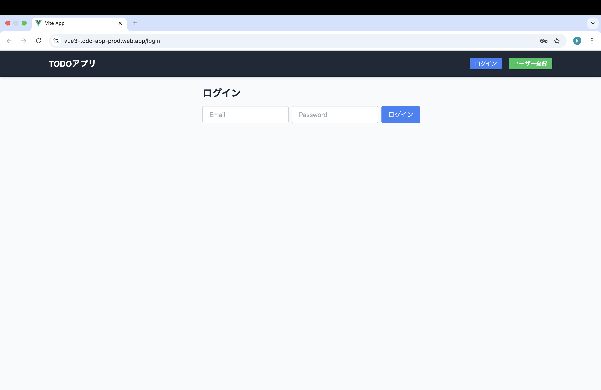
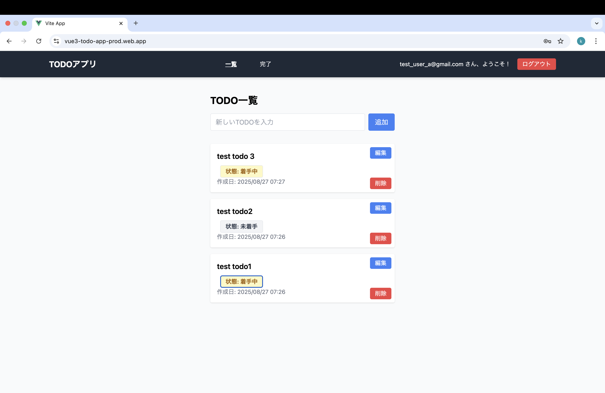
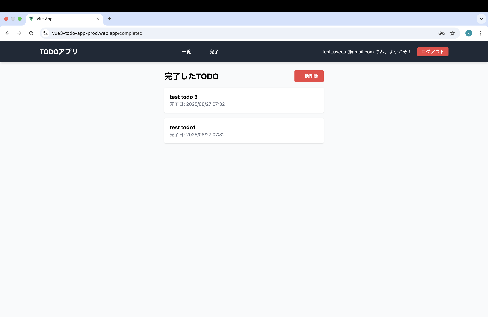
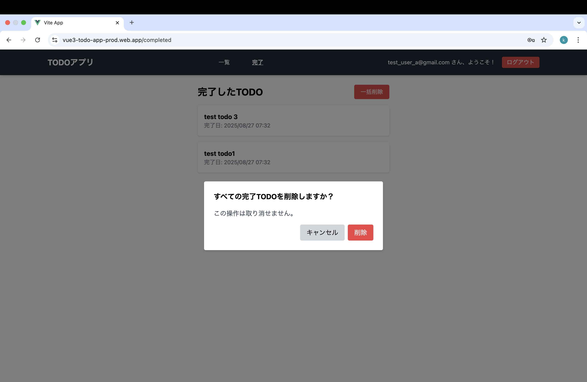
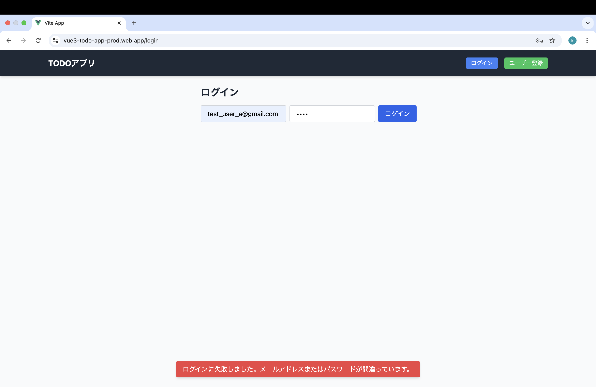

# Vue3 TODO アプリ

Vue 3 + TypeScript + Firebase を用いて開発したシンプルな TODO 管理アプリです。  
「めんどくさがりで、やることを忘れがちな自分」がタスクを手軽に管理できるように開発しました。

---

## アプリ概要

- Firebase Authentication を使用したログイン機能
- Firestore によるユーザーごとのTODOデータ保存
- 完了したTODOと未完了TODOの切り替え表示
- 完了日での並び替え、一括削除機能、削除確認モーダルなどを実装
- トースト通知やダークモードにも対応（開発中）

---

## 使用技術スタック

| 分類           | 使用技術                           |
| -------------- | ---------------------------------- |
| フロントエンド | Vue 3, TypeScript, Tailwind CSS    |
| バックエンド   | Firebase Authentication, Firestore |
| ビルド／構成   | Vite, ESLint, Prettier, vue-tsc    |
| ツール         | VSCode, GitHub                     |

---

## 主な機能

- ユーザー登録／ログイン（Firebase Auth）
- TODOの追加・編集・削除
- 完了/未完了の切り替え表示
- 完了日時でのソート表示
- 一括削除（確認モーダルあり）
- トースト通知（成功・失敗）

## スクリーンショット

### ログイン画面

### TODO一覧（未完了）

### 完了TODO画面

### 一括削除モーダル

### トースト通知

## セットアップ手順

### 1. 推奨IDE

- [Visual Studio Code](https://code.visualstudio.com/)
- 拡張機能: [Volar](https://marketplace.visualstudio.com/items?itemName=Vue.volar)（※Veturは無効化）

### 2. プロジェクト初期化

npm install

### 3. 開発サーバー起動（ホットリロード）

npm run dev

### 4. 型チェック・本番ビルド・最小化

npm run build

### 5. ESLintによるコード整形チェック

npm run lint

## テスト仕様

機能ごとに手動テストを行っています。  
テスト状況をまとめたスプレッドシートは以下に格納しています（※開発中）。

[tests/functional_test.xlsx](./tests/functional_test.xlsx)
